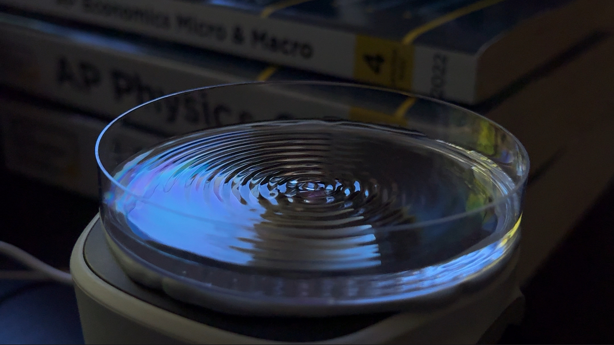
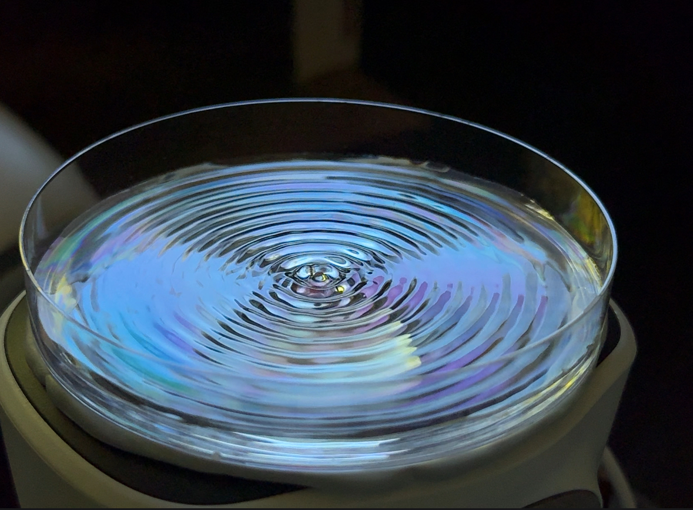
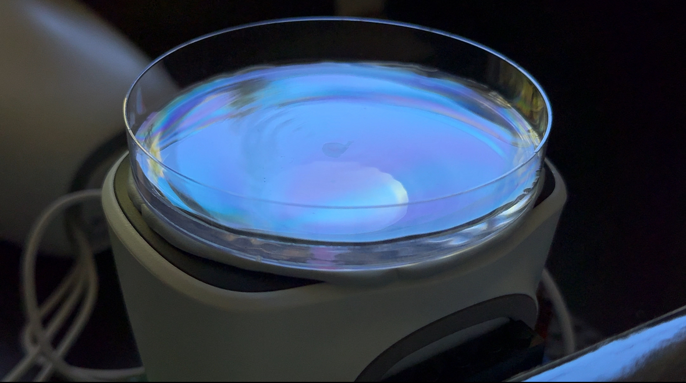

# WaterVibrationProj
Using a speaker and different hertz, I will observe how different hertz played by the speaker will effect the ripples in the water.

## 7/5/25
Current setup is a speaker is oriented upward and attached to a long cylinder right on top of it. The cylinder has a dip on the top that allows for a thin layer of water to be placed on the top. The cylinder and speaker is also held upright by a rectangular box. By connecting a computer to the speaker, I play different hertz and see the ripples on the top. 

Equations used:
λ = v/f (v is speed of the surface of the water in m/s, f is the frequency in hertz)
v = Sqrt(g*h) (g is gravity in m/s^2, h is the depth of the water in m)

## 7/13/25
Setup has changed so that instead of the original rectangular box I used to hold the setup up, I used a smaller cube-shaped box to hold the speaker upright. Also, there is no longer a cylinder attached to the top of the speaker. Instead, I placed a 90mm petri dish directly on the speaker. However, the results slightly differ from the previous setup as the frequency at which the ripples get chaotic seem to be lower. This is likely due to how much energy and vibrations is actually coming from the speaker to the water.

## 7/15/25
Setup change: I stacked multiple thin sponges on top of each other and placed them right on top of the cone of the speaker. Then, I placed the petri dish right on top of the tower of sponges. Now, results seem that the waves get chaotic at around 45hz range and the best frequency to see consistent ripples seems to be 35hz.

## 7/16/25
Improved the stack of thin sponges by carving the bottom 3 layers to have a smaller diameter so it fits the cone shape of the speaker. Also, I lowered the amplitude of the noise to prevent greater chaotic ripples. I am aiming to look for a solution so that the stack of sponges doesn't shift at all when the sound is played. Either some sort of more-frictiony material on the parts where the sponge and speaker touch or something else completely different from the sponge tower. 

## 7/21/25 

Made a Lego stand/structure to hold the speaker up straight and level. Continued using the sponge base to hold the petri dish above the speaker. Also used a flashlight level with the water to help view the ripples.

Science stuff:

Chaotic ripples/patterns in the water isn't as straight forward as the sound being too high frequency.

It depends on the energy buildup in the water. When there is too much energy in the system, the system will become unstable and chaotic. The energy depends on a multitude of factors:

- Frequency: Controls how rapidly energy is delivered to the water

- Amplitude/Volume: Changes the amount of energy per wave

- Time the sound is played: The longer the sound is being played, the more energy will accumulate in the water system.

All can be altered with the python script but I'm planning on choosing just one to be the independent variable while keeping the others controlled. However, time is the trickiest as even low frequencies will eventually become chaotic if given enough time. I think that the best course of action would be to keep a controlled amplitude, make the independent variable the frequency, and also only record up to frequencies where the ripples show some stability that can be recorded before it becomes chaotic.

Additional Notes:
Ohms in speakers means the electrical resistance which controls how much current flows through the speaker in this case. So overall, lower Ohms means more current and higher Ohms means less current. Furthermore, more current means more energy/current which in this case means louder volume. So lower Ohms means higher volume and vice versa in our case.

I created another possible experiment that is similar to the current one but instead of sound, it is slightly simpler. However, it still has similar concepts of water ripples and fluid dynamics. Possible issues of this idea is that the change of height may not have a significant enough impact on the wavelength of the ripples. Although it has a more direct impact on the amplitude of the waves, measuring the change in amplitude would be very difficult. Check below for the diagram:

## 7/22/25

I think that to have the most ideal and efficient method of conveying the sound vibrations into the water, there should be a different way of attaching the petri dish to the speaker than using the current sponge setup. Some possible ideas include gluing a metal sheet on top of the speaker and then attaching the petri dish to the plate. Another possibly simpler idea would be attaching the petri dish directly to the speaker using some putty substance such as blu tack.
Furthermore, it could be a combination of those two where the thin metal sheet is glued to the speaker and then the petri dish is attached to the sheet using the putty substance.

Shutter speed:

When recording/taking photos of the ripples in the water, the shutter speed of the camera and in our case the Iphone's shutter speed will likely impact the picture. I do think that if I do record with slow-mo it may be able to produce better results.  

Tested 60hz with an amplitude of 0.5. (Not exactly sure what units the amplitude is in simple audio/the python script)
Update: When I tried to film using slow-mo on my phone, there seems to be less waves visible compared to seeing it with my own eyes. This is likely due to a low shutter speed.

Important info: Even with a material such as rubber or sponge that absorbs the energy coming from the speaker, this will mainly affect the amplitude and not the frequency of the waves. Although, if the amplitude is too little, the frequency will likely be inaccurate too.

However, I still do think an alternate setup is needed instead of the current sponge one as when the sound is played for a long enough time, the sponge still shifts which produces non-ring-shaped ripples and therefore inaccurate results.

## 7/23/25

SPL: Sound Pressure Level

It is a measure of how loud/intense a sound wave is. It's in the units of decibels (dB SPL) and is based off of Pascals (Pa) which is the unit for the sound pressure of a sound wave.

I = (V/R):

This is Ohm's law which relates current, voltage, and resistance.

Current (in Amps): How much electric charge is passing through a conductor. If we think of the circuit like a water hose, the current would be how much water would be flowing out at the end. A wider hose would have more water coming out and a smaller one less.

Voltage (in Volts): Kind of how fast the current is passing through the conductor (flow rate). In the water hose example, it would be like the pressure of the water in the hose. A water gun would have less water coming out but higher pressure than a hose.

Resistance (in Ohms): Controlling the current so it isn't too high and therefore dangerous. In other words, it slows down the flow of current. Adding a resistor will change the current of the entire circuit.

P = V * I

P (Wattage in Watts): Used to measure how much energy is being used/produced per second.

For the speaker setup, I think using a reusable adhesive like blu-tack would be the best. It should be good at transmitting vibrations, easy to adjust, and also easy to remove if needed.

https://www.amazon.com/Blu-Tack-S050Q-Reusable-Adhesive-75g/dp/B001FGLX72

## 7/24/25

For the relationship between Power and SPL, I found that it has a logarithmic correspondence. Basically, you need to double the power to increase the SPL by 3dB.

Mainly studied how speakers work and also physics relating to sound. How for most speakers, there is a electromagnet, which is usually created by a copper coil, and a larger normal magnet around it. The electromagnet bounces back and forth according to the electrical signals given which effects how the magnetic fields of the electromagnet and the normal magnet interact. This "back and forth" movement creates the pressure forces in the air that we interpret as sound.

For sound waves, what I mainly learned is how sound waves consist of high pressure and low pressure areas of air that is created by the source which could be anything from speakers to a balloon popping. The terms for these are "compressions" for high pressure areas and "rarefactions" for the low pressure areas. Also little extra fact but I learned about timbre which is the unique waveform or sound that different sources of sound such as different instruments make. For example, even if a piano and a trumpet both play a middle c note, you can still tell the difference in the sound by their different timbre.

## 7/25/25

Read chapter 1 in the JBL Sound System Design Reference Manual.

Learned mainly about modelling sound waves as sine waves, along with the relationship between wavelength, velocity, and frequency.

Learned about how phase differences between two separate sounds can effect the amplitude of the waves. Alongside this, I learned about delayed sine waves where two signals arrive at a place at differing times.

Also learned a bit about diffraction of sound and how the size of the obstacle relative to the wavelength of the wave affects the sound waves.

Learned about how temperature affects sound waves as in areas of higher temperatures, the velocity will slightly increase relative to colder areas as warmer air molecules move faster/transmit the vibrations quicker. Lastly, I learned about how wind affects sound waves which is pretty straight forward. 

## 7/28/25

Using Blu-Tack, I attached the petri dish directly to the speaker and it seems to work well in conveying the sound as ripples.

Tested multiple frequencies along with differing amplitudes to better visualize non-chaotic ripples in the water.

Got 3 videos of 3 differing frequencies and amplitudes. 60hz amp:0.5, 40hz amp:1, 90hz amp:0.25. Got a frame of each one when the ripples are non-chaotic.

 (40hz)  
 (60hz)  
 (90hz)  

## 8/4/25

Since the petri dish is 90mm in diameter and 45mm in radius, we can count the number of waves in one of the images for one of the frequencies and compare them to the results from the equations/formulas. 

I also think I forgot to mention earlier, but since amplitude only really affects how high the peak of the waves are and how quickly the ripples turn chaotic, I altered the amplitude for differing frequencies so that it was easier to visualize the ripples.

For 40hz, there are about 10 waves. This means that the wavelength is about 4.5 mm. 

v = Sqrt(g*h) = Sqrt(9.81*0.004) = 0.19809 m/s
λ = v/f = 0.19809/40 = 4.952 mm 

For 60hz, there are about 15 waves. This means that the wavelength is about 3 mm. 

v = Sqrt(g*h) = Sqrt(9.81*0.004) = 0.19809 m/s
λ = v/f = 0.19809/60 = 3.301 mm 

The observed wavelengths are pretty close to the approximated wavelengths using the formulas above.

Some possible sources of error could've been:

- Sightly off approximation on how many waves there are in the picture

- Off measurements of the height of the water

- Imperfect sound coming from the speaker

Furthermore, there is a very close percent error of around 9% for both frequencies.

## 8/5/25 - 8/6/25

Mainly read/studied chapter two in the JBL Sound Design Ref. Manual.

- dBW = 10 log (P1/P0) where P1 is the measured power and P0 is the reference power. Furthermore, reference power is usually 1 Watt for converting to dBW if not stated.

- To humans, to make a sound "twice as loud", you would have to have a 10 times increase in power. Ex: A 10 watt signal would sound about twice as loud as a 1 watt signal.

- Furthermore, dB are useful for this reason as now to make a sound "twice as loud", you just have to increase the dbs by 10.

dBW	Measured Power (W) 
0	1 W
1	1.25 W
2	1.6 W
3	2 W
4	2.5 W
5	3.15 W
6	4 W
7	5 W
8	6.3 W
9	9 W
10	10 W

(Looking to memorize)

- Quick shortcuts when converting Watts to dB:

2× power = +3 dB

4× power = +6 dB

10× power = +10 dB

- Power Ratio Formula (Tells you how many times the actual power has gotten greater/smaller from an increase/decrease in decibels):

Power Ratio = 10^(dB/10)

or 

P1/P0 = 10^(dB/10)

Just an inverse version of dBW = 10 log (P1/P0)

- P = E*I (P=Power, E=Voltage, I=Current)

- P = I^2 * Z (Z=Impedance->Sorta like resistance but mainly for AC circuits while Resistors are for DC circuits) (Still have to do more studying on this part)

- P = (E^2)/Z

## 8/7/25

For 40hz, there are about 10 waves. This means that the wavelength is about 4.5 mm.

v = Sqrt(g*h) = Sqrt(9.81*0.004) = 0.19809 m/s
λ = v/f = 0.19809/40 = 4.952 mm

For 60hz, there are about 15 waves. This means that the wavelength is about 3 mm.

v = Sqrt(g*h) = Sqrt(9.81*0.004) = 0.19809 m/s
λ = v/f = 0.19809/60 = 3.301 mm

For 90hz, there are about 22 waves. This means that the wavelength is 2.045 mm.

v = Sqrt(g*h) = Sqrt(9.81*0.004) = 0.19809 m/s
λ = v/f = 0.19809/90 = 2.201 mm

Graphed the Data and applied a best fit inverse line to the data.
Further read chapter 2

- P = E*I (P=Power, E=Voltage, I=Current)

- P = I^2 * Z (Z=Impedance->Sorta like resistance but mainly for AC circuits while Resistors are for DC circuits) (Still have to do more studying on this part)

- P = (E^2)/Z
The lower two are simply derived from the first one using Ohm's Law
As shown in the 3rd equation, doubling the E will quadruple the P as E is raised to the power of two. Same case for the 2nd equation and I with P.
⦁	Power-Based dB vs SPL-Based dB
⦁	For dB SPL = 20*log(P1/P0)   (P stands for Pressure in pascals (Pa))

dB SPL  | Voltage Ratio
---
0       | 1
2       | 1.25
4       | 1.6
6       | 2
8       | 2.5
10      | 3
12      | 4
14      | 5
16      | 6.3
18      | 8
20      | 10
Used in the same way as used for the Power-Based dB
⦁	Common 0 dB References:

dB SPL – Sound Pressure Level
0 dB = 20 µPa (0.00002 Pa)

dBu – Voltage (unloaded)
0 dB = 0.775 V RMS

dBV – Voltage (referenced to 1V)
0 dB = 1.000 V RMS

dBm – Power
0 dB = 1 milliwatt (0.001 W), typically into 600 ohms

dBW – Power
0 dB = 1 watt
Just remember dB is just a ratio and there are many types of dB's such as dBV, dBu, dBW, dB SPL
I think I will combine these notes and the previous days notes about chapter 2 so that its easier to come back to and read.

- Phons are another unit related to sound. While db SPL is about the sound pressure level of the air, Phons are mainly used to measure perceived loudness.
⦁	The Phon and the dB SPL share the same numerical value only at 1000 Hz. When Phons and dB SPL are compared on a graph it shows the Robinson-Dadson equal loudness contours.
⦁	Robinson-Dadson equal loudness contours (also called Fletcher-Munson curves) are for the human ear. An equal loudness contour is simply graphs that show how loud a sound must be at each frequency for it to be perceived as equally loud by a human listener. In fact, the Robinson-Dadson curves were determined experimentally. Shows how we don't perceive certain frequencies as well as others.

## 8/18/25

Ran a couple more trials of frequencies of 30hz, 50hz, 70hz, 80hz, and 100hz. 

Furthermore, I think the main factor for the decent to high percent error is that a slight miscounting of waves where I either counted an extra wave or missed a wave could lead to a percent error of even 10%. However, as the # of waves increase due to having a higher frequency, the impact of a slight miscount lessens which is somewhat shown in our data as the percent error seems to lessen.

With further research and thinking, since my percent error is consistently negative, it means I'm likely overcounting the number of waves. Either I'm counting a fraction of a wave as a full wave or mistakenly counting the middle ring as a wave.

After recalculating the experimental wavelengths without the middle ring accounted, the data seems to match much better and seems much more reasonable. The middle "messy" ring shouldn't be accounted for because it's more of an initial response of the water to the sound from the center.

The new average percent error appears to be around + 1.54%.

Final Graph Below:
 
